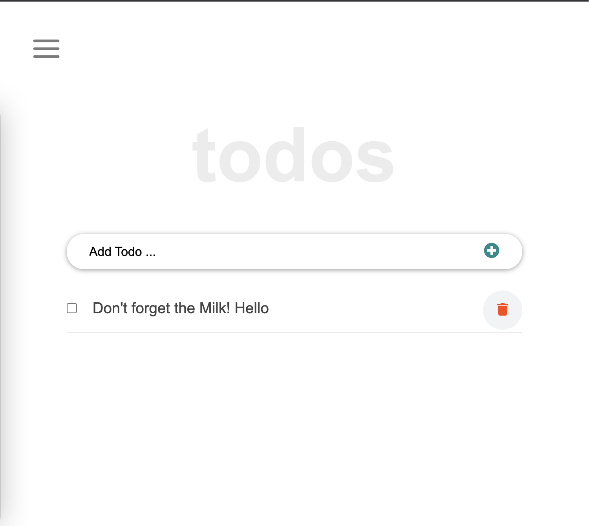

# React ToDo

> One paragraph statement about the project.

In this project, I will build a simple HTML/JS list of To Do tasks.

## Built With

- JavaScript
- React JS library
- Webpack

## Live Demo

[Live Demo Link](https://marijanbrvar.github.io/react-to-d)

## Getting Started

**When you open the application from the above link, you will be able to add a task to the default job list** immediately
**Otherwise, you can create a new list in the most left input field and add a new task to the current list.**

To get a local copy up and running, follow these simple example steps.

### Prerequisites
- Chrome browser
- Node v14.XX >
- npm (usually already installed with current node version)

### Setup
To run code locally, please follow steps belove
1. `git@github.com:marijanbrvar/react-to-do.git && cd react-to-do`
2. run `npm install`
3. then run `npm run start`

webpack will automatically open the default browser, and you can start using the ToDo web app. All data is stored locally, which means that all your job/tasks will stay present in the browser after the refresh.
### Usage
1. Add a new Job list by typing the name of the job in the left input field, then press enter or click to add button
2. After filling the form, press the "Enter" or 'Plus' button, and the application will store your task locally.
3. to edit double click on task or delete the task.

## Authors

👤 MARIJAN BRVAR

- GitHub: [@githubhandle](https://github.com/marijanbrvar)
- Twitter: [@twitterhandle](https://twitter.com/marijanbrvar)
- LinkedIn: [LinkedIn](https://linkedin.com/in/marijanbrvar)

dIn: [LinkedIn](https://linkedin.com/in/linkedinhandle)

## 🤝 Contributing

Contributions, issues, and feature requests are welcome!

Feel free to check the [issues page](../../issues/).

## Show your support

Give a ⭐️ if you like this project!

## 📝 License

This project is [MIT](./MIT.md) licensed.
